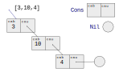
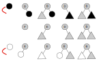
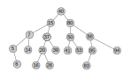
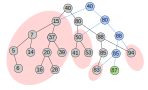

# Estruturas de dados funcionais

* Características
    * Imutabilidade
    * Persistência
    * Eficiência por compartilhamento
    * Processamento por recursão

* Casos
    * Listas
    * Árvores

## Listas

### Primeira ideia
```kotlin
package ed

sealed class Lista<A>
class Nil<A>: Lista<A>()  //Sem parâmetros, portanto não pode ser data class
data class Cons<A>(val cab: A, val cau: Lista<A>):Lista<A>()

val l1 = Cons(3, Cons(10, Cons (7, Nil())))

fun <A> tamanho (lista: Lista<A>): Int = when (lista) {
    is Nil -> 0
    is Cons -> 1 + tamanho(lista.cau)
}

fun soma (lista: Lista<Int>): Int = when (lista) {
    is Nil -> 0
    is Cons -> lista.cab + soma(lista.cau)
}
```


### Segunda ideia

* Orientação a objetos em Kotlin
    * `Nil` pode ser um objeto único na memória de programa
        * _Design pattern: Singleton_
            * `object` em vez de `class` 
        * `Nothing` como tipo parâmetro
            * `Nothing` é subclasse de qualquer classe
            * Um único `Nil<Nothing>` em vez de `Nil<Int>`, `Nil<String>`, etc.
            * Requer variância (`out`)

```kotlin
sealed class Lista<out A>   //
object Nil: Lista<Nothing>()
//...
val l1 = Cons(3, Cons(10, Cons (7, Nil)))   //Nil perde os parênteses
```

### `substituir`

```kotlin
fun <A> substituir(alvo: A, novo: A, lista: Lista<A> ): Lista<A> =
    when(lista) {
        is Nil -> Nil
        is Cons -> when {
            alvo == lista.cab -> Cons(novo, lista.cau)
            else -> Cons( lista.cab , substituir(alvo, novo, lista.cau) )
        }
    }
```


* `substituir`
    * A nova lista e a antiga lista compartilham um trecho

## Árvores

* Árvore binária
    * 4 tipos de nós
    * Compartilhamento
```kotlin
fun inserir(elem: Int, no: Arv<Int>): Arv<Int> =
    when (no) {
        is Folha -> when {
            elem >= no.valor -> RmD(no.valor, Folha(elem))
            else             -> RmE(no.valor, Folha(elem))
        }
        is RmE -> when {
            elem >= no.valor -> Bif(no.valor, no.rmE, Folha(elem))
            else             -> RmE(no.valor, inserir(elem, no.rmE))
        }
        is RmD -> when {
            elem >= no.valor -> RmD(no.valor, inserir(elem, no.rmD))
            else             -> Bif(no.valor, no.rmD, Folha(elem))
        }
        is Bif -> when {
            elem >= no.valor -> Bif(no.valor, no.rmE, inserir(elem, no.rmD))
            else             -> Bif(no.valor, inserir(elem, no.rmE), no.rmD)
        }
    }
```







### Memória

* `inserir`, versão em Haskell
```haskell
data Tree a = Leaf a
            | L a (Tree a)
            | R a (Tree a)
            | Bin a (Tree a) (Tree a)
            deriving (Eq, Show, Ord)

t1 :: Tree Int
t1 = Bin 40 (Leaf 15) (Leaf 80)

insert :: (Ord a) => a -> Tree a -> Tree a
insert x (Leaf y) | x >= y = R y (Leaf x)
                  | x < y  = L y (Leaf x)
insert x (L y tl) | x >= y = Bin y tl (Leaf x)
                  | x < y  = L y (insert x tl)
insert x (R y tr) | x >= y = R y (insert x tr)
                  | x < y  = Bin y (Leaf x) tr
insert x (Bin y tl tr) | x >= y = Bin y tl (insert x tr)
                       | x < y  = Bin y (insert x tl) tr
```