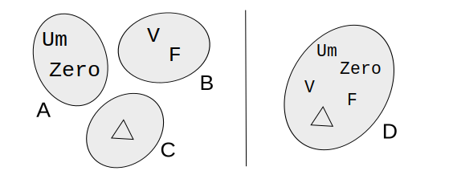
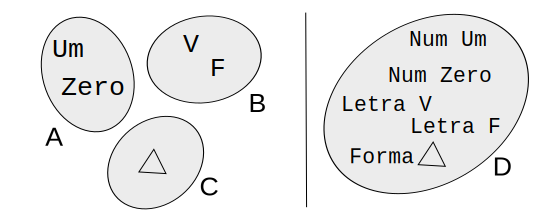

# Tipos algébricos de dados

> O projeto dos dados—em outras palavras, dos tipos—é o coração
> da programação funcional estaticamente tipada

* TAD ≠ TAD
* 0, 1, ⨉, +

Não confundir com Tipos Abstratos de Dados

"Algébricos" porque alguns tipos são como o 0,
outros como o 1, e há produto e soma.

## Tipo vazio

* Deve ser impossível representar qualquer valor desse tipo
* Haskell: `Void`
* Kotlin
    *`Nothing`
    * Usado como retorno de funções sem retorno
    * É o subtipo universal: é aceito como subtipo de qualquer tipo

```kotlin
fun f() : Nothing {
    while(true) ;
}

fun g() : Nothing {
    throw Exception // Sempre lança, logo nunca retorna
}
```

## Tipo unitário

* _Unit_ (unitário)
    * Só contém um valor, também chamado "_unit_"
    * Tipo unitário e valor unitário
* Haskell
    * Tipo: `()`
    * Valor `()`
* Kotlin
    * Tipo: `Unit`
    * Valor: `()`  (tupla vazia ou "_unit_")
* Não contém nenhuma informação
    * Aquilo que só pode valer 1 coisa, não traz informação
    * Um evento que tem 100% de probabilidade de ocorrer não traz informação
        * Teoria da informação 
        * I = log (1/P)
        * I = log (1/1) = 0

## Tipos produto

* A partir de tipos existentes, criar um novo tipo que é o "produto" deles
    * "Produto" como em "produto cartesiano"
    * Também pelo número de elementos (cardinalidade)
        * O número de elementos do novo tipo é o produto dos números dos tipos originais
* Em programação funcional estaticamente tipada
    * Tuplas
    * Registros (_Records_)

### Tuplas
Em programação funcional, tuplas estão presentes e há facilidade em criar e operar.

Por exemplo, em Haskell: `(3, True, 'c', 4.76, Pessoa "Ruy" 67)`


---
* Tuplas em Kotlin
    * `Pair`
    * `Triple`
    * Criação: `to`
    * Consumo: `first`, `second`, "quebra" (_destructuring_)


Em Kotlin, só há duas classes prontas que exercem a função de tuplas:
`Pair` e `Triple`, para tuplas de 2 e 3 posições respectivamente.

Para demais "larguras", a linguagem incentiva a criação de classes, 
visto que é tão barato criar classes em Kotlin em qualquer ponto do programa.

Para criar uma dupla: `Pair<>(4, "oi")`, ou `4 to "oi"`

Para consumir uma dupla: pelos campos (`first`, `second`)
ou por `val (a, b) = (4, "oi")`

### Registros
Uma forma de definir: tuplas em que cada componente tem um nome e é chamado de "campo"

* Variações
    * _Records_ em Pascal, Haskell
    * _Structs_ em C
    * Classes em Java, Kotlin

* Haskell
```haskell
data Novo = N Bool Char

data Xis = Xis Int Int String
 
m = N True 'c'
y = Xis 15 29 "cyt"
```
* Legenda
    * `Novo`, `Xis` - nome do tipo, ou também "construtor" do tipo
    * 'N', `Xis` - construtor de valor
    
---
* Por que "Tipos Produto" ?
    * Tem teoria de conjuntos: produto cartesiano
    * Número de elementos

* `Pair<Boolean, Bool>` tem 4 = 2 * 2 possíveis elementos
    * `(true, true)`
    * `(true, false)`
    * `(false, false)`
    * `(false, true)`

* `Pair<Boolean, Unit>` tem 2 = 2 * 1 possíveis elementos
    * `(true, ())`
    * `(false, ())`

## Tipos soma

* A partir de tipos existentes, cria um novo tipo que é a "soma" entre eles
    * Como a união de conjuntos (união disjunta, isto é, sem interseções)
* Pouco conhecidos fora da programação funcional
    * `union` e `enum` em C
🍎
---
* Por que "Tipos Soma"? (O argumento da cardinalidade)
    * Um tipo soma feito a partir de `Boolean` e `Unit` tem 3 = 2 + 1 elementos
        * `true`
        * `false`
        * `()`

* Pensando em termos de conjuntos, cria-se um novo conjunto a partir de conjuntos disjuntos.



* Mas essa é a visão abstrata, que é natural do ser humano. Só de bater o olho na imagem,
complexos processos cognitivos se estabelecem, nos quais os elementos são reconhecidos
e categorizados.



* Em Haskell:
```haskell
data A = Um | Zero deriving (Eq, Show)
data B = V | F deriving (Eq, Show)
data C = Triangulo deriving (Eq, Show)

data D = Numero A 
       | Letra B
       | Forma C
        deriving (Eq, Show)

v1 :: D
v1 = Numero Um

v2 :: D
v2 = Forma Triangulo

v3 :: D
v3 = Letra F
```

* Em Haskell, o mesmo mecanismo (tipos soma) tem várias funções, como criar as enumerações `A`, `B` e `C`.
    * `A`, `B`, `C`, `D` são construtores de tipos
    * `Um`, `Zero`, `V`, `F`, `Triangulo`, `Numero`, `Letra`, `Forma` são construtores de valores    
* Os outro tipos são "trazidos" para o novo tipo, mas eles recebem um "rótulo" diferenciando de onde vieram

---
* Tipos soma em Kotlin
    * [`enum class`](https://kotlinlang.org/docs/reference/enum-classes.html)
    * [`sealed class`](https://kotlinlang.org/docs/reference/sealed-classes.html)

```kotlin
enum class A {
    Um, Zero
}

enum class B {
    V, F
}

enum class C {
    Triangulo
}

sealed class D
data class Numero(val n:A) : D()
data class Letra(val l:B) : D()
data class Forma(val f:C) : D()

fun main() {
    val v1 : D = Numero(A.Um)
    val v2 : D = Forma(C.Triangulo)
    val v3 : D = Letra(B.F)
    println ("$v1 $v2 $v3")
}
```

---
* Como consumir tipos soma em linguagens funcionais estaticamente tipadas
    * Análise de casos, isto é, uma espécie de _switch_  baseada em tipos
    * _Pattern matching_
* Haskell
```haskell
f :: D -> String
f x = case x of
     Numero a -> "é numero, e o valor é " ++ show a
     Letra b -> "é letra, e o valor é " ++ show b
     Forma c -> "é forma, e o valor é " ++ show c

g :: D -> Int
g (Numero a) = 2
g (Letra b) = 10
g (Forma c) = 23
```

* Para consumir tipos soma em Kotlin:
    * _Matching_ 
    * `when`
    * _Smart casts_ 
* Não é exatamente o _pattern matching_, é menos versátil.

```kotlin
fun f (x : D) : String = when (x) {
    is Numero -> "é número, e o valor é ${x.n}"
    is Letra -> "é número, e o valor é ${x.l}"
    is Forma -> "é número, e o valor é ${x.f}"
}

fun g (x : D) : Int = when (x) {
    is Numero -> 2
    is Letra -> 10
    is Forma -> 23
}
```
---
* Tipos soma X herança

Em programação funcional em geral, não há o mecanismo de herança.

Na modelagem de dados em programação funcional, há similaridades
entre o emprego dos tipos soma e alguma forma de herança na
orientação a objetos.

⚠️ Mas não são conceitos equivalentes !!!

Em Kotlin, temos os 2 !!!

## Projeto de Tipos

* Baseado em 
"Domain modeling made functional: tackle software complexity with Domain-Driven Design and F#",
Scott Wlaschin, https://fsharpforfunandprofit.com

 